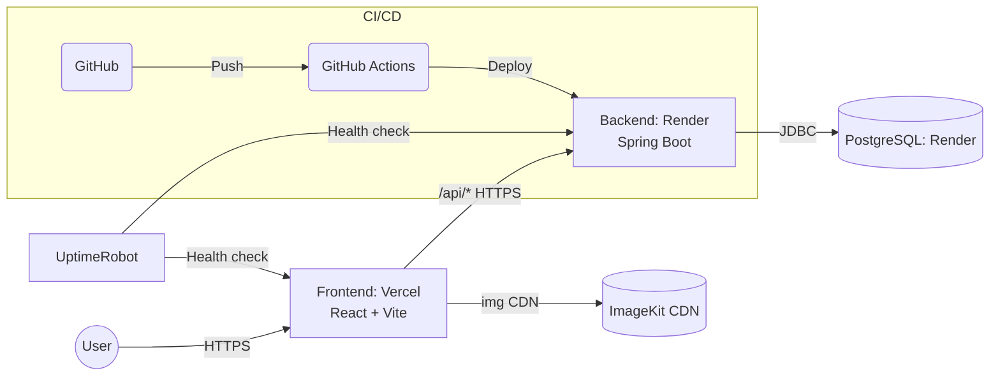

# 섭트폴리오 (SeoP Portfolio)

> 단순 기능 구현을 넘어 **실제 운영 가능한 서비스**를 직접 설계·배포하며 성장하는 개인 포트폴리오 관리 서비스

- Frontend: **React + Vite (Vercel)**
- Backend: **Spring Boot + Gradle + MyBatis (Render)**
- DB: **PostgreSQL (Render Managed)**
- Infra: **ImageKit (CDN), UptimeRobot (Healthcheck), GitHub Actions (CI/CD)**

---

## 목차
1. [프로젝트 소개 (Introduction)](#프로젝트-소개-introduction)  
2. [아키텍처 (Architecture)](#아키텍처-architecture)  
3. [기술 선택과 그 이유 (Tech Choices)](#기술-선택과-그-이유-tech-choices)  
4. [주요 기능 (Features)](#주요-기능-features)  
5. [향후 개선 계획 (Roadmap)](#향후-개선-계획-roadmap)  
6. [관련 링크 (Links)](#관련-링크-links)

---

## 프로젝트 소개 (Introduction)

과거 프로젝트 경험에서 부족했던 **보안, 성능 최적화, 테스트, 자동화된 배포 파이프라인**을 직접 설계·구축하며, ‘코더’를 넘어 **문제 해결 능력을 갖춘 개발자**로 성장하는 과정을 담은 개인 포트폴리오 관리 프로젝트입니다.

---

## 아키텍처 (Architecture)

### 요청 흐름
1. 사용자가 **Vercel 프론트엔드**에 접속(HTTPS)  
2. 클라이언트가 **`/api/**`** 요청 → **Render(Spring Boot)** 로 전달  
3. 백엔드에서 비즈니스 로직 수행 및 **PostgreSQL** 읽기/쓰기  
4. 이미지/썸네일은 **ImageKit CDN**으로 직접 서빙  
5. **UptimeRobot**이 주기적 헬스체크로 가용성 모니터링

---

## 기술 선택과 그 이유 (Tech Choices)

### Frontend (React & Vercel)
- **컴포넌트 기반 아키텍처(CBA)** 로 재사용성과 유지보수성 향상  
- Vercel의 **우수한 DX** 와 **자동화된 CI/CD**: GitHub 푸시만으로 빌드→배포

### Backend (Spring Boot & Render)
- 국내에서 가장 성숙한 생태계, 테스트·운영에 유리  
- 초기 배포 시 **환경변수/Java 버전 불일치** 문제를 **Docker 컨테이너** 로 해결 → 어느 환경에서도 동일하게 동작하는 배포 파이프라인 확립

### Database (PostgreSQL)
- **SQL 표준 준수**, `JSONB` 등 **확장성 높은 타입** 활용 가능 → 데이터 모델링/확장성 학습 목적

### Infra & DevOps
- **ImageKit**: 이미지 CDN·리사이징으로 서버 부하 감소 및 응답 속도 개선  
- **UptimeRobot**: Render 무료 티어의 **콜드 스타트** 완화용 주기적 헬스체크  
- **GitHub Actions**: 코드 변경 시 자동 **테스트 → 빌드 → 배포** 파이프라인

---

## 주요 기능 (Features)
- ✅ **JWT 쿠키 기반 인증** (회원가입/로그인)  
- ✅ **학력·경력·기술 스택·프로젝트** CRUD  
- ✅ **ImageKit 연동** 이미지 업로드 및 CDN 제공  
- ✅ **CI/CD 자동화** (Frontend: Vercel, Backend: GitHub Actions → Render)  
- ✅ **UptimeRobot** 기반 서비스 모니터링/헬스체크

---

## 향후 개선 계획 (Roadmap)
- **Frontend**: 라우트 기반 코드 스플리팅(Lazy-loading)로 초기 로딩 최적화  
- **Backend**: Swagger(OpenAPI)로 **API 문서 자동화**, `k6` 부하 테스트로 병목 구간 식별  
- **공통**: JUnit 기반 **단위/통합 테스트 커버리지 확대**, **ERD 상세화**, **ADR(Architecture Decision Record)** 축적

---

## 관련 링크 (Links)
- 🌐 **Frontend**: https://portfolio-front-dun.vercel.app/  
- 🌐 **Backend**: https://portfolio-back-prod.onrender.com  
- 🩺 **Healthcheck**: `/health`

> ⚠️ 운영 보안: 도메인/키/내부 엔드포인트 등 민감 정보는 저장소에 커밋하지 않고, Vercel/Render의 **환경 변수(Secrets)** 로 관리합니다.
